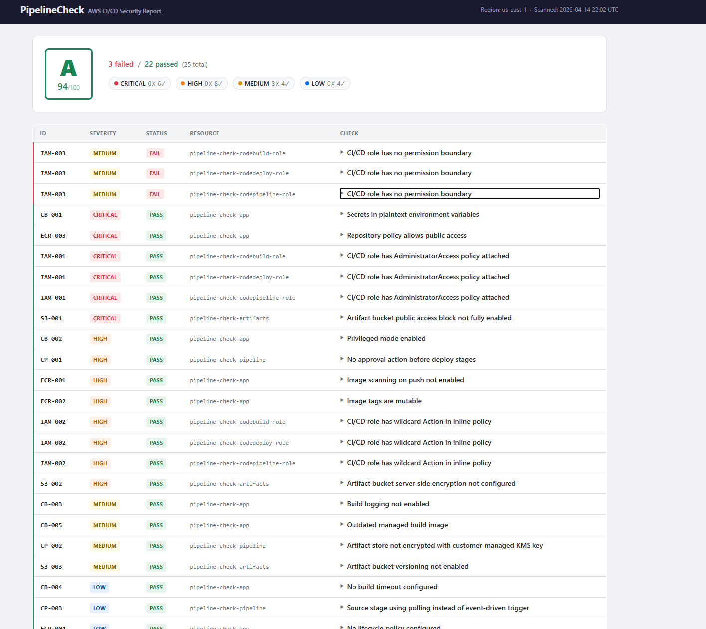

<div align="center">

# Pipeline-Check

**An AWS CI/CD security posture scanner.**

Pipeline-Check audits your AWS build, deploy, and artifact infrastructure
against well-known compliance standards and scores it A–D, so you can gate
pipelines on the result.

[What it checks](#what-it-checks) ·
[Installation](#installation) ·
[Usage](#usage) ·
[Compliance standards](#compliance-standards) ·
[Extending](#extending) ·
[CI / LocalStack](#ci--localstack-integration-test)



<sub><em>HTML report sample — generated with <code>--output html</code>.</em></sub>

</div>

---

## What it checks

Covered AWS services (**29 checks**, severity-weighted):

| Service       | Focus                                                                       | IDs               |
|---------------|-----------------------------------------------------------------------------|-------------------|
| CodeBuild     | Plaintext secrets, privileged mode, logging, timeouts, image freshness      | `CB-001…005`      |
| CodePipeline  | Manual approval gates, KMS encryption, event-driven vs polling triggers     | `CP-001…003`      |
| CodeDeploy    | Auto rollback, deployment strategy, CloudWatch alarm monitoring             | `CD-001…003`      |
| ECR           | Scan-on-push, tag immutability, public access, lifecycle policies           | `ECR-001…004`     |
| IAM           | `AdministratorAccess`, wildcard inline policies, permission boundaries      | `IAM-001…003`     |
| PBAC          | Build project VPC isolation, service-role sharing                           | `PBAC-001…002`    |
| S3            | Public access block, encryption, HTTPS-only policy, access logging          | `S3-001…004`      |

Every finding is tagged with the compliance controls it evidences (OWASP
Top 10 CI/CD + CIS AWS Foundations — see [Compliance standards](#compliance-standards)).
Findings are scored 0–100 and graded A–D. Exit code is `1` when the grade
is D, so `pipeline_check` works as a CI gate.

Planned providers: **GCP**, **GitHub Actions**, **Azure Pipelines**.

---

## Installation

```bash
git clone https://github.com/your-org/pipeline-check.git
cd pipeline-check
pip install -e .
```

Python ≥ 3.10 is required. Credentials are picked up from the standard AWS
chain (`~/.aws/credentials`, env vars, instance profile, SSO).

---

## Usage

```bash
# Scan everything in us-east-1
pipeline_check

# Scope to a specific pipeline
pipeline_check --target my-production-pipeline

# Only show HIGH and above
pipeline_check --target my-production-pipeline --severity-threshold HIGH

# Different region, named profile
pipeline_check --pipeline aws --region eu-west-1 --profile my-profile

# Run specific checks only
pipeline_check --checks CB-001 --checks IAM-001

# Restrict to a single compliance standard
pipeline_check --standard owasp_cicd_top_10

# List every registered standard
pipeline_check --list-standards

# JSON output (pipe to jq, save as artifact, etc.)
pipeline_check --output json

# HTML report
pipeline_check --output html --output-file /tmp/report.html

# Terminal + JSON at the same time
pipeline_check --output both
```

### Options

| Flag                    | Default                       | Description                                                   |
|-------------------------|-------------------------------|---------------------------------------------------------------|
| `--pipeline`            | `aws`                         | Pipeline environment (`aws`; `gcp`, `github`, `azure` planned) |
| `--target`              | _(all)_                       | Scope to a named resource (e.g. a CodePipeline name)          |
| `--checks`              | _(all)_                       | Check ID(s) to run — repeat for multiple                      |
| `--standard`            | _(all registered)_            | Compliance standard(s) to annotate findings with              |
| `--list-standards`      | _(flag)_                      | Print every registered standard and exit                      |
| `--region`              | `us-east-1`                   | AWS region                                                    |
| `--profile`             | _(env)_                       | AWS CLI named profile                                         |
| `--output`              | `terminal`                    | `terminal`, `json`, `html`, or `both`                         |
| `--output-file`         | `pipeline-check-report.html`  | Output path — only used with `--output html`                  |
| `--severity-threshold`  | `INFO`                        | Minimum severity to include                                   |

> **`--target` scoping:** CodePipeline fetches only the named pipeline;
> S3 checks discover the artifact bucket from it. CodeBuild, CodeDeploy,
> ECR, and IAM still scan the full region — use `--checks` to narrow those.

> **`--output both`:** the terminal report is written to **stderr** and the
> JSON to **stdout**, so you can pipe or redirect them independently:
> ```bash
> pipeline_check --output both 2>report.txt | jq '.score'
> ```

### Exit codes

| Code | Meaning        |
|------|----------------|
| `0`  | Grade A/B/C    |
| `1`  | Grade D        |
| `2`  | AWS API error  |

---

## Compliance standards

Every finding is enriched post-scan with a list of `ControlRef` objects —
references to controls in registered compliance standards. A single check
can evidence controls in multiple standards at once, so one scan satisfies
multiple frameworks.

| Name                  | Title                                   | Version | Docs                                             |
|-----------------------|-----------------------------------------|---------|--------------------------------------------------|
| `owasp_cicd_top_10`   | OWASP Top 10 CI/CD Security Risks       | 2022    | [docs/standards/owasp_cicd_top_10.md](docs/standards/owasp_cicd_top_10.md)     |
| `cis_aws_foundations` | CIS AWS Foundations Benchmark (subset)  | 3.0.0   | [docs/standards/cis_aws_foundations.md](docs/standards/cis_aws_foundations.md) |

Standards are pure data — each one is a Python module under
`pipeline_check/core/standards/data/` that declares its controls and a
`check_id → [control_id, …]` mapping. Adding SOC 2, NIST 800-53, or a
bespoke internal policy is one new module; see
[docs/standards/README.md](docs/standards/README.md) for the full contract.

---

## Architecture

```
pipeline_check/
├── cli.py                         # click CLI entry point
├── lambda_handler.py              # AWS Lambda entry point
└── core/
    ├── scanner.py                 # provider-agnostic orchestrator
    ├── scorer.py                  # weighted scoring + grading
    ├── reporter.py                # terminal (rich) + JSON output
    ├── html_reporter.py           # self-contained HTML report
    ├── providers/                 # provider registry (AWS built-in)
    │   ├── base.py                # BaseProvider ABC
    │   └── aws.py                 # boto3-backed provider
    ├── standards/                 # compliance standards (data-driven)
    │   ├── base.py                # ControlRef + Standard dataclasses
    │   ├── registry.py            # register / get / resolve
    │   └── data/
    │       ├── owasp_cicd_top_10.py
    │       └── cis_aws_foundations.py
    └── checks/
        ├── base.py                # Finding dataclass, Severity enum, BaseCheck ABC
        └── aws/
            ├── base.py            # AWSBaseCheck — wires boto3 Session
            ├── codebuild.py       # CB-001 … CB-005
            ├── codepipeline.py    # CP-001 … CP-003
            ├── codedeploy.py      # CD-001 … CD-003
            ├── ecr.py             # ECR-001 … ECR-004
            ├── iam.py             # IAM-001 … IAM-003
            ├── pbac.py            # PBAC-001 … PBAC-002
            ├── s3.py              # S3-001 … S3-004
            └── rules/             # per-check YAML metadata for HTML report
```

See [docs/providers/](docs/providers/) for the provider catalogue and
[docs/standards/](docs/standards/) for the compliance matrices.

---

## Lambda packaging

```bash
bash scripts/build_lambda.sh
# Output: dist/pipeline_check-lambda.zip
```

Deploy `pipeline_check.lambda_handler.handler` as the handler.

### Environment variables

| Variable                         | Description                                                         |
|----------------------------------|---------------------------------------------------------------------|
| `PIPELINE_CHECK_RESULTS_BUCKET`  | S3 bucket for JSON reports (stored under `reports/<timestamp>/`)    |
| `PIPELINE_CHECK_SNS_TOPIC_ARN`   | SNS topic alerted when CRITICAL findings are detected               |

### Event payload

```json
{ "region": "eu-west-1" }
```

Omit to fall back to `AWS_REGION`.

### Return value

```json
{
  "statusCode": 200,
  "grade": "B",
  "score": 78,
  "total_findings": 22,
  "critical_failures": 0,
  "report_s3_key": "reports/20240501T120000Z/pipeline_check-report.json"
}
```

### Required IAM permissions

```json
{
  "Version": "2012-10-17",
  "Statement": [{
    "Effect": "Allow",
    "Action": [
      "codebuild:ListProjects", "codebuild:BatchGetProjects",
      "codepipeline:ListPipelines", "codepipeline:GetPipeline",
      "codedeploy:ListApplications", "codedeploy:ListDeploymentGroups",
      "codedeploy:BatchGetDeploymentGroups",
      "ecr:DescribeRepositories", "ecr:GetRepositoryPolicy", "ecr:GetLifecyclePolicy",
      "iam:ListRoles", "iam:ListAttachedRolePolicies", "iam:ListRolePolicies", "iam:GetRolePolicy",
      "s3:GetPublicAccessBlock", "s3:GetEncryptionConfiguration",
      "s3:GetBucketVersioning", "s3:GetBucketLogging"
    ],
    "Resource": "*"
  }]
}
```

---

## Extending

### Adding a new AWS check

1. Create `pipeline_check/core/checks/aws/<service>.py`:

    ```python
    from .base import AWSBaseCheck, Finding, Severity

    class MyServiceChecks(AWSBaseCheck):
        def run(self) -> list[Finding]:
            client = self.session.client("myservice")
            ...
            return findings
    ```

2. Register it in `pipeline_check/core/providers/aws.py` by appending the
   class to `check_classes`.
3. (Optional) Add rule metadata at
   `pipeline_check/core/checks/aws/rules/<service>.yml` to enrich the HTML
   report.
4. Add unit tests in `tests/aws/test_<service>.py`.
5. Add mappings for the new check IDs in the relevant standard file under
   `pipeline_check/core/standards/data/`.

Check IDs use the format `<PREFIX>-<NNN>` (e.g. `CB-001`). The Scanner,
CLI, and reporters pick up the new check automatically.

### Adding a new provider (GCP, GitHub, Azure, …)

1. Create `pipeline_check/core/providers/<provider>.py` subclassing
   `BaseProvider`, set `NAME`, and implement `build_context()` and
   `check_classes`.
2. Register it in `pipeline_check/core/providers/__init__.py`.
3. Add check modules under `pipeline_check/core/checks/<provider>/` and
   tests under `tests/<provider>/`.

The new provider becomes available via `--pipeline <name>` without
touching `scanner.py` or `cli.py`. See [docs/providers/README.md](docs/providers/README.md).

### Adding a new compliance standard

Create one Python module under `pipeline_check/core/standards/data/`:

```python
from ..base import Standard

STANDARD = Standard(
    name="soc2_trust_services",
    title="SOC 2 Trust Services Criteria",
    version="2017",
    url="https://www.aicpa-cima.com/...",
    controls={"CC6.1": "Logical access controls", ...},
    mappings={
        "IAM-001": ["CC6.1"],
        "S3-001":  ["CC6.1"],
        ...
    },
)
```

Register it in `pipeline_check/core/standards/__init__.py`. The CLI
(`--standard`, `--list-standards`) and reporters pick it up automatically.

---

## CI / LocalStack integration test

The `LocalStack Integration Test` workflow
(`.github/workflows/localstack-test.yml`) runs manually from
**Actions → LocalStack Integration Test → Run workflow**. It consists of
two independent jobs:

1. **`pytest-integration`** — boots its own LocalStack, creates resources
   directly via `boto3`, runs the pytest suite under `tests/integration/`,
   and tears everything down.
2. **`terraform-fixture`** — boots a separate LocalStack, applies the
   Terraform fixtures in `infra/` (good and bad), runs the CLI against
   both, and asserts the expected grades and check failures.

### Required secret

| Secret                     | Where to get it                                                              |
|----------------------------|------------------------------------------------------------------------------|
| `LOCALSTACK_AUTH_TOKEN`    | [app.localstack.cloud](https://app.localstack.cloud) → CI Auth Tokens        |

Add it under **Settings → Secrets and variables → Actions → New repository secret**.

---

## License

MIT — see [LICENSE](LICENSE).
