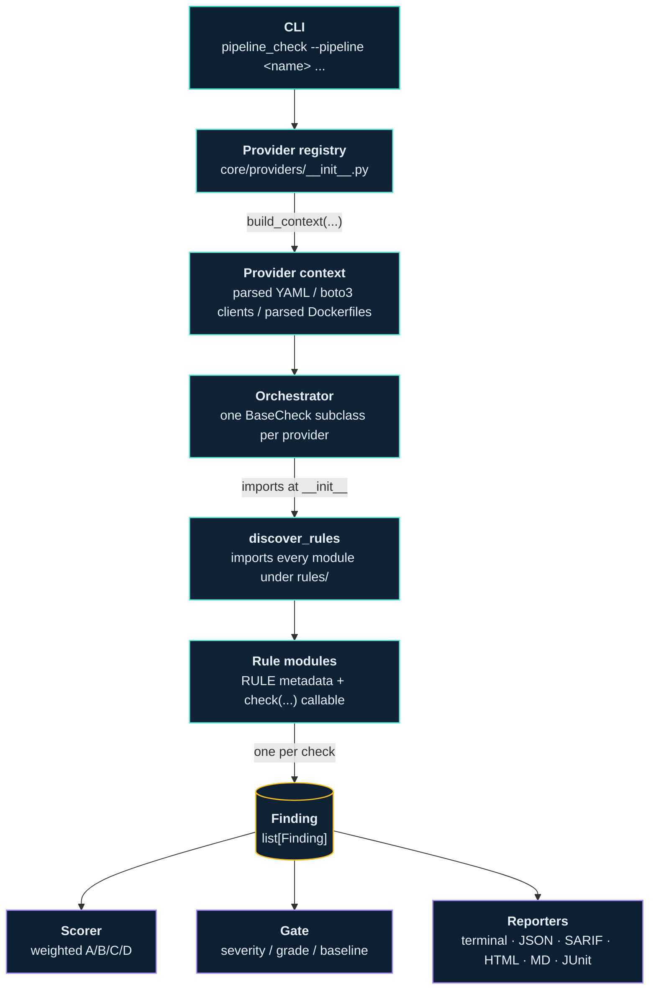

# Architecture

A short tour of how a scan flows through the codebase.

## Layers

The package is organized in three concentric rings.

### Edge: CLI and entry points

`pipeline_check/cli.py` is a Click command. Almost all of it parses
flags, validates them, and passes a kwarg dict to the scanner.
`pipeline_check/lambda_handler.py` is the AWS Lambda equivalent — it
calls into the same scanner.

### Middle: Scanner, scorer, gate, reporters

`core/scanner.py` is provider-agnostic. It looks up the named provider
in the registry, calls `build_context(...)`, then iterates that
provider's `check_classes`. Each class is constructed with the
context, its `run()` method returns a list of `Finding`s, and the
scanner concatenates them.

`core/scorer.py` weights findings (CRITICAL=20, HIGH=10, MED=5, LOW=2)
and produces an A/B/C/D grade. `core/gate.py` evaluates the gate
condition (severity threshold, baseline diff) and produces an exit
code. The reporters (`core/reporter.py`, `html_reporter.py`,
`sarif_reporter.py`, `markdown_reporter.py`, `junit_reporter.py`,
`config.py`) all consume the same `list[Finding]` plus the score.

### Inner: providers, contexts, rules

Each provider lives in `core/providers/<name>.py`. Its job is two
things: build the per-provider context (parse YAML, load AWS clients,
read Dockerfiles), and declare which check classes to run. See
[Adding a provider](writing_a_provider.md) for the full pattern.

Each provider's check classes live under
`core/checks/<name>/`. The class is a thin orchestrator; the actual
detection lives in per-rule modules under `core/checks/<name>/rules/`.
A rule is one module that exports a `RULE` (metadata) and a `check`
function (behavior). The orchestrator auto-discovers rules at import
time. See [Adding a rule](writing_a_rule.md) for the contract.

## Standards mapping

`core/standards/data/<name>.py` maps check IDs to control IDs for one
external framework (OWASP CICD Top 10, NIST 800-53, SLSA, …). The
mappings are loaded by `core/standards/__init__.py` and applied to
findings during scoring. The mappings file is the *authoritative*
source for compliance evidence; the `owasp` / `esf` fields on a `Rule`
are doc-generation hints only.

## Confidence demotion

Some rules use heuristics that misfire on specific legitimate
patterns (curl-pipe to vendor installers, environment names that
happen to look like deployment targets). Those rules emit findings
at HIGH confidence, then a centralized demotion in
`core/checks/_confidence.py` drops the confidence to LOW for the
rules in its blanket-demotion list.

A rule that wants to keep an explicit HIGH confidence on a specific
finding (e.g. a CB-005 that's two versions behind) sets
`Finding.confidence_locked = True`; the scanner then skips the
demotion step for that finding.

## Caching

Each `BaseCheck.__init__` clears the per-instance blob cache used by
`walk_strings` / `blob_lower` (in `core/checks/blob.py`). Cross-rule
cache reuse within a single scan is forfeited; the `id()` reuse
across GC'd doc objects returns stale blob data otherwise. Profile
data shows the cache cost is dwarfed by YAML parsing.

## Adding things

- **A rule** for an existing provider — one file under
  `core/checks/<provider>/rules/`. See [Adding a rule](writing_a_rule.md).
- **A provider** — one file under `core/providers/`, one package under
  `core/checks/`. See [Adding a provider](writing_a_provider.md).
- **A standard** — one file under `core/standards/data/`, register in
  `core/standards/__init__.py`. The mapping is a `dict[check_id,
  list[control_id]]`.
- **A reporter** — one module that consumes `list[Finding]` + score
  and emits whatever format you need. Wire it into the CLI's
  `--output` option.
- **An attack chain** — one file under `core/chains/rules/` that
  declares which check IDs co-firing on the same target signal a
  multi-step attack chain.
