<section class="pg-hero" markdown>

  <svg viewBox="0 0 64 64" preserveAspectRatio="xMidYMid meet" aria-hidden="true">
    <path d="M32 6 L54 13 V31 C54 44.5 44.5 53.5 32 58 C19.5 53.5 10 44.5 10 31 V13 Z" fill="none" stroke="#f0f2f5" stroke-width="2.5" stroke-linejoin="round"/>
    <path d="M22 32 L29 39 L43 24" stroke="#1ba3a9" stroke-width="3" stroke-linecap="round" stroke-linejoin="round" fill="none"/>
  </svg>

pipeline-check · v{{ version }}

# Catch supply-chain risks before they ship.

A read-only scanner for 39 providers, graded against 18 compliance frameworks. 
120 of the 1220+ checks also emit a one-shot patch you can apply with <code>--fix</code>.

  <a class="md-button" href="usage/">Get started</a>
  <a class="md-button" href="https://github.com/dmartinochoa/pipeline-check" target="_blank" rel="noopener">View on GitHub</a>

  <svg width="14" height="14" viewBox="0 0 24 24" fill="none" stroke="currentColor" stroke-width="2.5" stroke-linecap="round" stroke-linejoin="round"><polyline points="20 6 9 17 4 12"/></svg> MIT licensed
  <svg width="14" height="14" viewBox="0 0 24 24" fill="none" stroke="currentColor" stroke-width="2.5" stroke-linecap="round" stroke-linejoin="round"><polyline points="20 6 9 17 4 12"/></svg> No telemetry
  <svg width="14" height="14" viewBox="0 0 24 24" fill="none" stroke="currentColor" stroke-width="2.5" stroke-linecap="round" stroke-linejoin="round"><polyline points="20 6 9 17 4 12"/></svg> No API tokens
  <svg width="14" height="14" viewBox="0 0 24 24" fill="none" stroke="currentColor" stroke-width="2.5" stroke-linecap="round" stroke-linejoin="round"><polyline points="20 6 9 17 4 12"/></svg> Python 3.11+

  
Example scan of a GitHub Actions repository. Running <code>pipeline_check --pipeline github</code> reports 16 findings (2 critical, 4 high, 7 medium, 3 low) for a score of 47 out of 100, grade D. Findings map to OWASP CI/CD Top 10, NIST SSDF, SLSA, and CIS Supply Chain. 4 of the 16 are auto-fixable with <code>--apply</code>.

  

    
      <svg width="12" height="12" viewBox="0 0 24 24" fill="none" stroke="currentColor" stroke-width="2" stroke-linecap="round" stroke-linejoin="round"><path d="M14 2H6a2 2 0 0 0-2 2v16a2 2 0 0 0 2 2h12a2 2 0 0 0 2-2V8z"/><polyline points="14 2 14 8 20 8"/></svg>
      payments-api · github
    
    scan
  

$ pipeline_check --pipeline github Pipeline-Check v{{ version }} · scanning .github/workflows/    CRITICAL  GHA-008  Credential-shaped literal in workflow body            .github/workflows/release.yml:31  echo "token=ghp_…"  HIGH      GHA-001  Action not pinned to commit SHA            .github/workflows/release.yml:14  uses: actions/checkout@v4  HIGH      GHA-016  Remote script piped to shell interpreter            .github/workflows/build.yml:42  curl … | bash  MEDIUM    GHA-015  Job has no timeout-minutes, unbounded build            .github/workflows/test.yml:9  job: test Score  47 / 100   Grade D        2 critical · 4 high · 7 medium · 3 low Standards  OWASP CI/CD Top 10 · NIST SSDF · SLSA · CIS Supply Chain → Fix suggestions written to pipeline-check.sarif→ Run with --apply to autofix 4 of 16 findings.

</section>

<section class="pg-stats" data-reveal>

  

1220+

Checks

  

39

Providers

  

18

Compliance standards

  

120

Autofixers

</section>

<section class="pg-section" data-reveal markdown>

// capabilities

<h2 class="pg-section__title">One scanner. Every pipeline you ship through.</h2>

Same severity model and report format whether you're scanning a Jenkinsfile,
Terraform (plan JSON or raw HCL), or a live AWS account. Findings carry control IDs for OWASP,
NIST SSDF, SLSA, and the rest, so audit answers don't require leaving the tool.

<svg viewBox="0 0 24 24" fill="none" stroke="currentColor" stroke-linecap="round" stroke-linejoin="round"><path d="M12 22s8-4 8-10V5l-8-3-8 3v7c0 6 8 10 8 10z"/></svg>

### OWASP 10/10 coverage
Every one of the OWASP Top 10 CI/CD Security Risks has at least one rule across
the supported providers. New risks land here before they land in your pipeline.
<a class="pg-feature__link" href="standards/owasp_cicd_top_10/">Read OWASP coverage</a>

<svg viewBox="0 0 24 24" fill="none" stroke="currentColor" stroke-linecap="round" stroke-linejoin="round"><polyline points="22 12 18 12 15 21 9 3 6 12 2 12"/></svg>

### Live AWS + shift-left IaC
Scan a running AWS account through boto3, *or* scan Terraform plans (or raw HCL source) and
CloudFormation templates before provisioning. Same rule IDs, same severities.
<a class="pg-feature__link" href="providers/aws/">AWS reference</a>

<svg viewBox="0 0 24 24" fill="none" stroke="currentColor" stroke-linecap="round" stroke-linejoin="round"><polygon points="13 2 3 14 12 14 11 22 21 10 12 10 13 2"/></svg>

### Attack-chain correlation
56 multi-finding chains mapped to MITRE ATT&CK, including the cross-provider
`XPC-NNN` family that fires when GitHub Actions, Dockerfile, Helm, and OCI
findings line up in one scan. The `TAINT-NNN` dataflow engine follows
attacker-controllable input across cross-step boundaries on five providers
(GitHub Actions, GitLab CI, Buildkite, Tekton, Argo Workflows), each routed
through that host's native channel: `$GITHUB_OUTPUT`, dotenv artifact,
`buildkite-agent meta-data`, Tekton results, Argo `outputs.parameters`.
<a class="pg-feature__link" href="attack_chains/">Attack chains</a>

<svg viewBox="0 0 24 24" fill="none" stroke="currentColor" stroke-linecap="round" stroke-linejoin="round"><circle cx="11" cy="11" r="7"/><path d="M21 21l-4.3-4.3"/><path d="M11 8v3l2 2"/></svg>

### Supply-chain depth on demand
`--resolve-remote` turns on the network-backed checks: a cooldown gate on freshly
published packages, OSV advisory lookups, OpenSSF Scorecard and build-provenance
signals, and live secret verification that probes a leaked credential against its
issuing API (two dozen services) and promotes a confirmed-live token to CRITICAL.
Off by default so the base scan stays hermetic.
<a class="pg-feature__link" href="usage/#what-resolve-remote-unlocks">Supply-chain checks</a>

<svg viewBox="0 0 24 24" fill="none" stroke="currentColor" stroke-linecap="round" stroke-linejoin="round"><path d="M3 7l9-4 9 4-9 4-9-4z"/><path d="M3 12l9 4 9-4"/><path d="M3 17l9 4 9-4"/></svg>

### Benchmarked on real goats
Recall is locked against deliberately-vulnerable training repos: 100% on
`cicd-goat`, `cfngoat`, and `kubernetes-goat`. Every rule change that stops a
goat finding from firing trips the bench in CI, so coverage can't silently
regress between releases.
<a class="pg-feature__link" href="goat_bench/">GOAT bench</a>

<svg viewBox="0 0 24 24" fill="none" stroke="currentColor" stroke-linecap="round" stroke-linejoin="round"><path d="M14.7 6.3a1 1 0 0 0 0 1.4l1.6 1.6a1 1 0 0 0 1.4 0l3.77-3.77a6 6 0 0 1-7.94 7.94l-6.91 6.91a2.12 2.12 0 0 1-3-3l6.91-6.91a6 6 0 0 1 7.94-7.94l-3.76 3.76z"/></svg>

### Findings that fix themselves
120 of the checks ship a one-shot patch. `--fix` prints a unified diff you can
pipe to `git apply`, `--apply` writes the edits in place, and the `fix-pr`
subcommand commits them to a fresh branch and opens the pull request (or GitLab
MR). Fixers carry a `safe` / `unsafe` tier, so the default pass only touches
edits that can't change behavior, and they're idempotent.
<a class="pg-feature__link" href="ci_gate/#autofix-fix">Autofix</a>

<svg viewBox="0 0 24 24" fill="none" stroke="currentColor" stroke-linecap="round" stroke-linejoin="round"><path d="M9 11l3 3L22 4"/><path d="M21 12v7a2 2 0 0 1-2 2H5a2 2 0 0 1-2-2V5a2 2 0 0 1 2-2h11"/></svg>

### CI gate that does its job
Severity thresholds, baseline diffs against a git ref, ignore files with
expiries, glob check selection, autofix emit-or-apply. Failing the build is
the default; turning it off is opt-in.
<a class="pg-feature__link" href="ci_gate/">CI gate</a>

<svg viewBox="0 0 24 24" fill="none" stroke="currentColor" stroke-linecap="round" stroke-linejoin="round"><circle cx="5" cy="6" r="2"/><circle cx="19" cy="6" r="2"/><circle cx="12" cy="18" r="2"/><path d="M7 7l4 9M17 7l-4 9"/></svg>

### Org-wide fleet scanning
Point `fleet --from-org <org>` (or `--repos repos.yml`) at a whole GitHub /
GitLab / Bitbucket org. It clones and scans every repo in parallel, writes one
graded digest ranked worst-first, and re-runs the cross-repo `CXPC-NNN` attack
chains over the union, catching risks that only exist *between* repos. A posture
graph (repos as nodes, cross-repo chains as edges) ships in `fleet.json`.
<a class="pg-feature__link" href="fleet/">Fleet scanning</a>

<svg viewBox="0 0 24 24" fill="none" stroke="currentColor" stroke-linecap="round" stroke-linejoin="round"><path d="M21 15a2 2 0 0 1-2 2H7l-4 4V5a2 2 0 0 1 2-2h14a2 2 0 0 1 2 2z"/></svg>

### Output that integrates
Rich terminal table for humans, JSON / JSON Lines for scripts and log
pipelines, HTML report (with a per-resource blast-radius heatmap and an
attack-chains panel) for sharing, SARIF 2.1.0 for GitHub code scanning and
Defender for DevOps, CycloneDX + SPDX SBOMs, plus markdown for PR comments,
GitHub Actions annotations, CSV, and JUnit XML for test-runner UIs.
<a class="pg-feature__link" href="output/">Output formats</a>

<svg viewBox="0 0 24 24" fill="none" stroke="currentColor" stroke-linecap="round" stroke-linejoin="round"><polyline points="16 18 22 12 16 6"/><polyline points="8 6 2 12 8 18"/></svg>

### Inline in your editor
The Pipeline-Check VS Code extension drives the same rule registry as the CLI,
surfaced as you edit workflow files. Install from the
<a href="https://marketplace.visualstudio.com/items?itemName=greylag-ci.pipeline-check">VS Code Marketplace</a>
or <a href="https://open-vsx.org/extension/greylag-ci/pipeline-check">Open VSX</a>;
source lives at <a href="https://github.com/greylag-ci/pipeline-check-vscode">greylag-ci/pipeline-check-vscode</a>.
<a class="pg-feature__link" href="vscode/">VS Code extension</a>

<svg viewBox="0 0 24 24" fill="none" stroke="currentColor" stroke-linecap="round" stroke-linejoin="round"><rect x="3" y="4" width="18" height="12" rx="2"/><path d="M8 20h8"/><path d="M12 16v4"/><circle cx="9" cy="10" r="1"/><circle cx="15" cy="10" r="1"/></svg>

### MCP server for AI clients
Drive scans and introspect the rule catalog from Claude Desktop, Claude Code,
Cursor, Continue, or Zed over the Model Context Protocol. Runs locally on
stdio: no network egress, no telemetry, no API tokens.
<a class="pg-feature__link" href="mcp/">MCP server</a>

<svg viewBox="0 0 24 24" fill="none" stroke="currentColor" stroke-linecap="round" stroke-linejoin="round"><circle cx="12" cy="12" r="10"/><path d="M2 12h20M12 2a15.3 15.3 0 0 1 4 10 15.3 15.3 0 0 1-4 10 15.3 15.3 0 0 1-4-10 15.3 15.3 0 0 1 4-10z"/></svg>

### Zero phone-home
Workflow files are parsed from disk. AWS uses the standard boto3 credential
chain. Nothing leaves your machine. MIT licensed, no signup, no account.
<a class="pg-feature__link" href="https://github.com/dmartinochoa/pipeline-check">GitHub</a>

</section>

<section class="pg-section" data-reveal markdown>

// providers

<h2 class="pg-section__title">Wherever your builds run.</h2>

Auto-detect picks the provider for you, or pass <code>--pipeline &lt;name&gt;</code>
to force one. Counts reflect the current rule catalog.

  CI/CD platforms
  <a class="pg-provider" href="providers/github/">GitHub Actions{{ providers.github.checks }}</a>
  <a class="pg-provider" href="providers/gitlab/">GitLab CI{{ providers.gitlab.checks }}</a>
  <a class="pg-provider" href="providers/bitbucket/">Bitbucket Pipelines{{ providers.bitbucket.checks }}</a>
  <a class="pg-provider" href="providers/azure/">Azure DevOps{{ providers.azure.checks }}</a>
  <a class="pg-provider" href="providers/jenkins/">Jenkins{{ providers.jenkins.checks }}</a>
  <a class="pg-provider" href="providers/circleci/">CircleCI{{ providers.circleci.checks }}</a>
  <a class="pg-provider" href="providers/cloudbuild/">Google Cloud Build{{ providers.cloudbuild.checks }}</a>
  <a class="pg-provider" href="providers/buildkite/">Buildkite{{ providers.buildkite.checks }}</a>
  <a class="pg-provider" href="providers/drone/">Drone CI{{ providers.drone.checks }}</a>
  <a class="pg-provider" href="providers/tekton/">Tekton{{ providers.tekton.checks }}</a>
  <a class="pg-provider" href="providers/argo/">Argo Workflows{{ providers.argo.checks }}</a>
  <a class="pg-provider" href="providers/gitea/">Gitea / Forgejo Actions{{ providers.gitea.checks }}</a>

  Cloud & infrastructure as code
  <a class="pg-provider" href="providers/aws/">AWS{{ providers.aws.checks }}</a>
  <a class="pg-provider" href="providers/azure_cloud/">Azure Cloud{{ providers.azure_cloud.checks }}</a>
  <a class="pg-provider" href="providers/gcp/">GCP{{ providers.gcp.checks }}</a>
  <a class="pg-provider" href="providers/terraform/">Terraform{{ providers.terraform.checks }}</a>
  <a class="pg-provider" href="providers/cloudformation/">CloudFormation{{ providers.cloudformation.checks }}</a>
  <a class="pg-provider" href="providers/pulumi/">Pulumi{{ providers.pulumi.checks }}</a>

  Containers & deployment
  <a class="pg-provider" href="providers/dockerfile/">Dockerfile{{ providers.dockerfile.checks }}</a>
  <a class="pg-provider" href="providers/modelfile/">Modelfile{{ providers.modelfile.checks }}</a>
  <a class="pg-provider" href="providers/kubernetes/">Kubernetes{{ providers.kubernetes.checks }}</a>
  <a class="pg-provider" href="providers/helm/">Helm{{ providers.helm.checks }}</a>
  <a class="pg-provider" href="providers/argocd/">Argo CD{{ providers.argocd.checks }}</a>
  <a class="pg-provider" href="providers/oci/">OCI manifest{{ providers.oci.checks }}</a>

  SCM posture
  <a class="pg-provider" href="providers/scm/">GitHub{{ providers.scm.checks }}</a>
  <a class="pg-provider" href="providers/scm/">GitLab{{ providers.scm.checks }}</a>
  <a class="pg-provider" href="providers/scm/">Bitbucket{{ providers.scm.checks }}</a>

  Package registries
  <a class="pg-provider" href="providers/npm/">npm{{ providers.npm.checks }}</a>
  <a class="pg-provider" href="providers/pypi/">PyPI{{ providers.pypi.checks }}</a>
  <a class="pg-provider" href="providers/maven/">Maven{{ providers.maven.checks }}</a>
  <a class="pg-provider" href="providers/nuget/">NuGet{{ providers.nuget.checks }}</a>
  <a class="pg-provider" href="providers/gomod/">Go modules{{ providers.gomod.checks }}</a>
  <a class="pg-provider" href="providers/cargo/">Cargo (Rust){{ providers.cargo.checks }}</a>
  <a class="pg-provider" href="providers/composer/">Composer (PHP){{ providers.composer.checks }}</a>
  <a class="pg-provider" href="providers/rubygems/">RubyGems (Ruby){{ providers.rubygems.checks }}</a>

</section>

<section class="pg-section" data-reveal markdown>

// flow

<h2 class="pg-section__title">Inputs in. Graded report out.</h2>

Click any stage to jump to its reference page.

  <a class="pg-pipe pg-pipe--src" href="usage/">
    <svg viewBox="0 0 24 24" fill="none" stroke="currentColor" stroke-width="2" stroke-linecap="round" stroke-linejoin="round"><path d="M14 2H6a2 2 0 0 0-2 2v16a2 2 0 0 0 2 2h12a2 2 0 0 0 2-2V8z"/><polyline points="14 2 14 8 20 8"/></svg>
    Input
    Repo on disk or live cloud account
  </a>
  <a class="pg-pipe" href="providers/">
    <svg viewBox="0 0 24 24" fill="none" stroke="currentColor" stroke-width="2" stroke-linecap="round" stroke-linejoin="round"><path d="M4 15s1-1 4-1 5 2 8 2 4-1 4-1V3s-1 1-4 1-5-2-8-2-4 1-4 1z"/><line x1="4" y1="22" x2="4" y2="15"/></svg>
    Adapter
    Auto-detect or <code>--pipeline</code>
  </a>
  <a class="pg-pipe" href="attack_chains/">
    <svg viewBox="0 0 24 24" fill="none" stroke="currentColor" stroke-width="2" stroke-linecap="round" stroke-linejoin="round"><path d="M12 22s8-4 8-10V5l-8-3-8 3v7c0 6 8 10 8 10z"/></svg>
    Rule engine
    1220+ checks with severity and fix
  </a>
  <a class="pg-pipe" href="standards/">
    <svg viewBox="0 0 24 24" fill="none" stroke="currentColor" stroke-width="2" stroke-linecap="round" stroke-linejoin="round"><path d="M3 7l9-4 9 4-9 4-9-4z"/><path d="M3 12l9 4 9-4"/><path d="M3 17l9 4 9-4"/></svg>
    Compliance map
    18 frameworks (OWASP, NIST, SLSA, CIS)
  </a>
  <a class="pg-pipe" href="scoring_model/">
    <svg viewBox="0 0 24 24" fill="none" stroke="currentColor" stroke-width="2" stroke-linecap="round" stroke-linejoin="round"><polyline points="22 12 18 12 15 21 9 3 6 12 2 12"/></svg>
    Scorer
    0 &ndash; 100 score, graded A / B / C / D
  </a>

  

  
Output formats

  

    <a class="pg-pipe-out" href="output/#terminal">
      <svg viewBox="0 0 24 24" fill="none" stroke="currentColor" stroke-width="2" stroke-linecap="round" stroke-linejoin="round"><polyline points="4 17 10 11 4 5"/><line x1="12" y1="19" x2="20" y2="19"/></svg>
      Terminal
      Rich color table for humans
    </a>
    <a class="pg-pipe-out" href="output/#json">
      <svg viewBox="0 0 24 24" fill="none" stroke="currentColor" stroke-width="2" stroke-linecap="round" stroke-linejoin="round"><path d="M8 3H7a2 2 0 0 0-2 2v5a2 2 0 0 1-2 2 2 2 0 0 1 2 2v5a2 2 0 0 0 2 2h1"/><path d="M16 3h1a2 2 0 0 1 2 2v5a2 2 0 0 0 2 2 2 2 0 0 0-2 2v5a2 2 0 0 1-2 2h-1"/></svg>
      JSON
      Machine-parseable for scripts
    </a>
    <a class="pg-pipe-out" href="output/#html">
      <svg viewBox="0 0 24 24" fill="none" stroke="currentColor" stroke-width="2" stroke-linecap="round" stroke-linejoin="round"><path d="M14 2H6a2 2 0 0 0-2 2v16a2 2 0 0 0 2 2h12a2 2 0 0 0 2-2V8z"/><polyline points="14 2 14 8 20 8"/><line x1="16" y1="13" x2="8" y2="13"/><line x1="16" y1="17" x2="8" y2="17"/></svg>
      HTML report
      Client-side filters, shareable
    </a>
    <a class="pg-pipe-out" href="output/#sarif">
      <svg viewBox="0 0 24 24" fill="none" stroke="currentColor" stroke-width="2" stroke-linecap="round" stroke-linejoin="round"><path d="M12 22s8-4 8-10V5l-8-3-8 3v7c0 6 8 10 8 10z"/><polyline points="9 12 11 14 15 10"/></svg>
      SARIF 2.1.0
      GitHub code scanning, Defender
    </a>
  

  

  

    <a class="pg-pipe-gate" href="ci_gate/">
      <svg viewBox="0 0 24 24" fill="none" stroke="currentColor" stroke-width="2" stroke-linecap="round" stroke-linejoin="round"><polygon points="13 2 3 14 12 14 11 22 21 10 12 10 13 2"/></svg>
      CI gate
    </a>
    
      <svg viewBox="0 0 24 24" fill="none" stroke="currentColor" stroke-width="2.5" stroke-linecap="round" stroke-linejoin="round"><polyline points="20 6 9 17 4 12"/></svg>
      Merge
    
    
      <svg viewBox="0 0 24 24" fill="none" stroke="currentColor" stroke-width="2.5" stroke-linecap="round" stroke-linejoin="round"><line x1="18" y1="6" x2="6" y2="18"/><line x1="6" y1="6" x2="18" y2="18"/></svg>
      Block
    
  

</section>

<section class="pg-section" data-reveal markdown>

// the patrol

<h2 class="pg-section__title">Every commit walks the same rail.</h2>

  

</section>

<section class="pg-cta" data-reveal markdown>

## Ship pipelines you trust.

Install in under 30 seconds. Scan your first repo in under a minute.

pip install pipeline-check

  <a class="md-button md-button--primary" href="usage/">Read the docs</a>
  <a class="md-button" href="https://github.com/dmartinochoa/pipeline-check">Star on GitHub</a>

</section>
