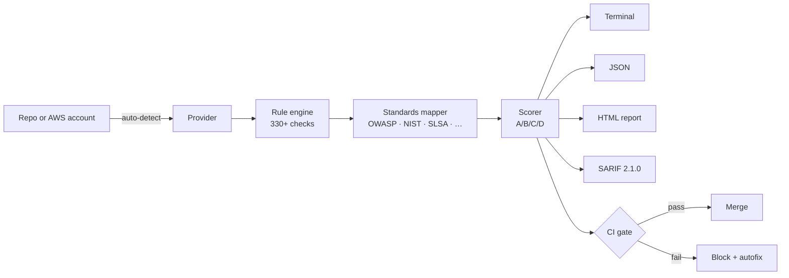

<section class="pg-hero" markdown>
<div class="pg-hero__inner" markdown>

<div markdown>
<span class="pg-hero__eyebrow"><span class="dot"></span>Open source · MIT licensed</span>

# Find security risks in your <span class="accent">CI/CD pipelines</span> before attackers do.

<p class="pg-hero__lede">
Pipeline-Check scans CI/CD configurations across ten platforms and a live AWS account
against the <strong>OWASP Top 10 CI/CD Risks</strong> plus twelve other compliance
frameworks. Every finding ships with a fix, a control mapping, and a CI gate.
</p>

<div class="pg-hero__cta">
  <a class="md-button md-button--primary" href="usage/">Get started</a>
  <a class="md-button" href="https://github.com/dmartinochoa/pipeline-check" target="_blank" rel="noopener">View on GitHub</a>
</div>

<div class="pg-hero__badges">
  <a href="https://github.com/dmartinochoa/pipeline-check/actions/workflows/python-app.yml"></a>
  <a href="https://pypi.org/project/pipeline-check/"></a>
  
  
</div>
</div>

<div class="pg-terminal" aria-hidden="true">
  <div class="pg-terminal__chrome">
    <span class="red"></span><span class="amber"></span><span class="green"></span>
    <span class="title">~/projects/payments-api</span>
  </div>
<div class="pg-terminal__body"><span class="prompt">$</span> pipeline_check <span class="arg">--pipeline github</span>

<span class="label">Pipeline-Check</span> v0.2.1 · scanning <span class="dim">.github/workflows/</span>

  <span class="crit">CRITICAL</span>  GHA-001  Action pinned to mutable tag
            <span class="dim">.github/workflows/release.yml:14  uses: actions/checkout@v4</span>
  <span class="high">HIGH    </span>  GHA-016  Pipe-to-shell from untrusted host
            <span class="dim">.github/workflows/build.yml:42  curl … | bash</span>
  <span class="med">MEDIUM  </span>  GHA-023  TLS verification disabled
            <span class="dim">.github/workflows/deploy.yml:88  curl --insecure</span>
  <span class="low">LOW     </span>  GHA-015  No timeout-minutes on job <span class="dim">test</span>

<span class="label">Score</span>  47 / 100   <span class="grade-d">Grade D</span>
        <span class="dim">2 critical · 4 high · 7 medium · 3 low</span>

<span class="label">Standards</span>  OWASP CI/CD Top 10 · NIST SSDF · SLSA · CIS Supply Chain

<span class="ok">→</span> Fix suggestions written to <span class="dim">pipeline-check.sarif</span>
<span class="ok">→</span> Run with <span class="dim">--apply</span> to autofix 4 of 16 findings.
</div>
</div>

</div>
</section>

<section class="pg-stats" markdown>
<div class="pg-stats__inner">
  <div class="pg-stat"><div class="pg-stat__num">330+</div><div class="pg-stat__label">Checks</div></div>
  <div class="pg-stat"><div class="pg-stat__num">10</div><div class="pg-stat__label">Providers</div></div>
  <div class="pg-stat"><div class="pg-stat__num">13</div><div class="pg-stat__label">Compliance standards</div></div>
  <div class="pg-stat"><div class="pg-stat__num">68</div><div class="pg-stat__label">Autofixers</div></div>
</div>
</section>

<section class="pg-section" markdown>
<div class="pg-section__eyebrow">Why Pipeline-Check</div>
<h2 class="pg-section__title">One scanner. Every pipeline you ship through.</h2>
<p class="pg-section__lede">
The same severity model and report format whether you're scanning a Jenkinsfile,
a Terraform plan, or a live AWS account. Every finding is mapped to OWASP, NIST
SSDF, SLSA, and the rest — so you can answer audit questions without leaving the
tool.
</p>

<div class="pg-features" markdown>

<div class="pg-feature" markdown>
<div class="pg-feature__icon">
<svg xmlns="http://www.w3.org/2000/svg" viewBox="0 0 24 24" fill="none" stroke="currentColor" stroke-width="2" stroke-linecap="round" stroke-linejoin="round"><path d="M12 22s8-4 8-10V5l-8-3-8 3v7c0 6 8 10 8 10z"/></svg>
</div>
### OWASP 10/10 coverage
Every one of the OWASP Top 10 CI/CD Security Risks has at least one check across
the supported providers. New risks land here before they land in your pipeline.
[Read more →](standards/owasp_cicd_top_10.md)
</div>

<div class="pg-feature" markdown>
<div class="pg-feature__icon">
<svg xmlns="http://www.w3.org/2000/svg" viewBox="0 0 24 24" fill="none" stroke="currentColor" stroke-width="2" stroke-linecap="round" stroke-linejoin="round"><polyline points="22 12 18 12 15 21 9 3 6 12 2 12"/></svg>
</div>
### Live AWS + shift-left IaC
Scan a running AWS account through boto3, *or* scan Terraform plans and
CloudFormation templates before provisioning — same rule IDs, same severities.
[AWS reference →](providers/aws.md)
</div>

<div class="pg-feature" markdown>
<div class="pg-feature__icon">
<svg xmlns="http://www.w3.org/2000/svg" viewBox="0 0 24 24" fill="none" stroke="currentColor" stroke-width="2" stroke-linecap="round" stroke-linejoin="round"><path d="M9 11l3 3L22 4"/><path d="M21 12v7a2 2 0 0 1-2 2H5a2 2 0 0 1-2-2V5a2 2 0 0 1 2-2h11"/></svg>
</div>
### CI gate that does its job
Severity thresholds, baseline diffs against a git ref, ignore files with
expiries, glob check selection, autofix emit-or-apply. Failing your build is the
default; turning it off is opt-in.
[CI gate →](ci_gate.md)
</div>

<div class="pg-feature" markdown>
<div class="pg-feature__icon">
<svg xmlns="http://www.w3.org/2000/svg" viewBox="0 0 24 24" fill="none" stroke="currentColor" stroke-width="2" stroke-linecap="round" stroke-linejoin="round"><polygon points="13 2 3 14 12 14 11 22 21 10 12 10 13 2"/></svg>
</div>
### Attack-chain correlation
Multi-finding chains mapped to MITRE ATT&CK. See the kill chain — token leak →
artifact poisoning → production push — instead of three disconnected findings.
[Attack chains →](attack_chains.md)
</div>

<div class="pg-feature" markdown>
<div class="pg-feature__icon">
<svg xmlns="http://www.w3.org/2000/svg" viewBox="0 0 24 24" fill="none" stroke="currentColor" stroke-width="2" stroke-linecap="round" stroke-linejoin="round"><path d="M21 15a2 2 0 0 1-2 2H7l-4 4V5a2 2 0 0 1 2-2h14a2 2 0 0 1 2 2z"/></svg>
</div>
### Output that integrates
Rich terminal table for humans, JSON for scripts, HTML report with client-side
filters for sharing, SARIF 2.1.0 for GitHub code scanning and Defender for
DevOps.
[Output formats →](output.md)
</div>

<div class="pg-feature" markdown>
<div class="pg-feature__icon">
<svg xmlns="http://www.w3.org/2000/svg" viewBox="0 0 24 24" fill="none" stroke="currentColor" stroke-width="2" stroke-linecap="round" stroke-linejoin="round"><circle cx="12" cy="12" r="10"/><path d="M2 12h20M12 2a15.3 15.3 0 0 1 4 10 15.3 15.3 0 0 1-4 10 15.3 15.3 0 0 1-4-10 15.3 15.3 0 0 1 4-10z"/></svg>
</div>
### No telemetry, no API tokens
Workflow files are parsed from disk. AWS uses the standard boto3 credential
chain. Nothing leaves your machine. MIT licensed, no phone-home, no account.
[GitHub →](https://github.com/dmartinochoa/pipeline-check)
</div>

</div>
</section>

<section class="pg-section--alt">
<div class="pg-section__inner" markdown>
<div class="pg-section__eyebrow">Providers</div>
<h2 class="pg-section__title">Wherever your builds run.</h2>
<p class="pg-section__lede">
Auto-detect picks the provider for you, or pass <code>--pipeline &lt;name&gt;</code>
to force one. Counts below reflect the current rule catalogue.
</p>

<div class="pg-providers" markdown>
  <a class="pg-provider" href="providers/aws/">AWS<span class="pg-provider__count">71 checks</span></a>
  <a class="pg-provider" href="providers/terraform/">Terraform<span class="pg-provider__count">parity</span></a>
  <a class="pg-provider" href="providers/cloudformation/">CloudFormation<span class="pg-provider__count">~63 checks</span></a>
  <a class="pg-provider" href="providers/github/">GitHub Actions<span class="pg-provider__count">29 checks</span></a>
  <a class="pg-provider" href="providers/gitlab/">GitLab CI<span class="pg-provider__count">30 checks</span></a>
  <a class="pg-provider" href="providers/bitbucket/">Bitbucket<span class="pg-provider__count">27 checks</span></a>
  <a class="pg-provider" href="providers/azure/">Azure DevOps<span class="pg-provider__count">28 checks</span></a>
  <a class="pg-provider" href="providers/jenkins/">Jenkins<span class="pg-provider__count">31 checks</span></a>
  <a class="pg-provider" href="providers/circleci/">CircleCI<span class="pg-provider__count">30 checks</span></a>
  <a class="pg-provider" href="providers/cloudbuild/">Cloud Build<span class="pg-provider__count">9 checks</span></a>
</div>
</div>
</section>

<section class="pg-section" markdown>
<div class="pg-section__eyebrow">How it works</div>
<h2 class="pg-section__title">Inputs in, graded report out.</h2>
<p class="pg-section__lede">
A single scan flow: detect the provider, parse its config (or hit boto3 for
AWS), run rules, score, gate.
</p>


</section>

<section class="pg-cta">
<div class="pg-cta__inner" markdown>
## Ship pipelines you trust.
<p>Install in under 30 seconds. Scan your first repo in under a minute.</p>

```bash
pip install pipeline-check
pipeline_check
```

<div class="pg-hero__cta" style="justify-content: center; margin-top: 1.5rem;">
  <a class="md-button md-button--primary" href="usage/">Read the usage guide</a>
  <a class="md-button" href="https://github.com/dmartinochoa/pipeline-check">Star on GitHub</a>
</div>
</div>
</section>
