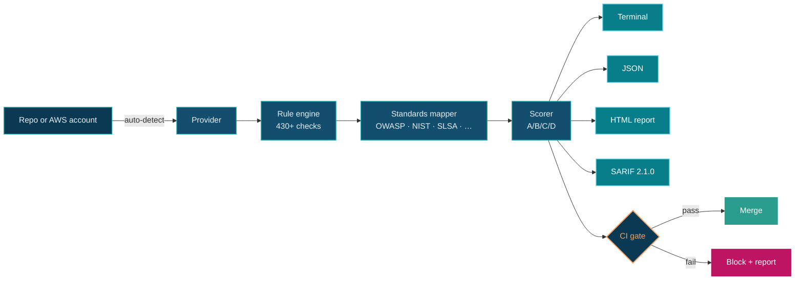

<section class="pg-hero">

pipeline-check · v{{ version }}

# Catch supply-chain risks before they ship.

A read-only scanner for twelve providers — eleven file-based formats and
live AWS via boto3 — graded against the OWASP Top 10 CI/CD Risks plus
twelve compliance frameworks. Every finding ships with a control mapping
and a written remediation; 81 of the 430+ checks also emit a one-shot
patch you can apply with <code>--fix</code>.

  <a class="md-button md-button--primary" href="usage/">Get started</a>
  <a class="md-button" href="https://github.com/dmartinochoa/pipeline-check" target="_blank" rel="noopener">View on GitHub</a>

  <svg width="14" height="14" viewBox="0 0 24 24" fill="none" stroke="currentColor" stroke-width="2.5" stroke-linecap="round" stroke-linejoin="round"><polyline points="20 6 9 17 4 12"/></svg> MIT licensed
  <svg width="14" height="14" viewBox="0 0 24 24" fill="none" stroke="currentColor" stroke-width="2.5" stroke-linecap="round" stroke-linejoin="round"><polyline points="20 6 9 17 4 12"/></svg> No telemetry
  <svg width="14" height="14" viewBox="0 0 24 24" fill="none" stroke="currentColor" stroke-width="2.5" stroke-linecap="round" stroke-linejoin="round"><polyline points="20 6 9 17 4 12"/></svg> No API tokens
  <svg width="14" height="14" viewBox="0 0 24 24" fill="none" stroke="currentColor" stroke-width="2.5" stroke-linecap="round" stroke-linejoin="round"><polyline points="20 6 9 17 4 12"/></svg> Python 3.10+

  

    
      <svg width="12" height="12" viewBox="0 0 24 24" fill="none" stroke="currentColor" stroke-width="2" stroke-linecap="round" stroke-linejoin="round"><path d="M14 2H6a2 2 0 0 0-2 2v16a2 2 0 0 0 2 2h12a2 2 0 0 0 2-2V8z"/><polyline points="14 2 14 8 20 8"/></svg>
      payments-api · github
    
    scan
  

$ pipeline_check --pipeline github Pipeline-Check v{{ version }} · scanning .github/workflows/   CRITICAL  GHA-001  Action not pinned to commit SHA            .github/workflows/release.yml:14  uses: actions/checkout@v4  HIGH      GHA-016  Pipe-to-shell from untrusted host            .github/workflows/build.yml:42  curl … | bash  MEDIUM    GHA-023  TLS verification disabled            .github/workflows/deploy.yml:88  curl --insecure  LOW       GHA-015  No timeout-minutes on job test Score  47 / 100   Grade D        2 critical · 4 high · 7 medium · 3 low Standards  OWASP CI/CD Top 10 · NIST SSDF · SLSA · CIS Supply Chain → Fix suggestions written to pipeline-check.sarif→ Run with --apply to autofix 4 of 16 findings.

</section>

<section class="pg-stats">

  

430+

Checks

  

12

Providers

  

13

Compliance standards

  

81

Autofixers

</section>

<section class="pg-section" markdown>

// capabilities

<h2 class="pg-section__title">One scanner. Every pipeline you ship through.</h2>

Same severity model and report format whether you're scanning a Jenkinsfile,
a Terraform plan, or a live AWS account. Findings carry control IDs for OWASP,
NIST SSDF, SLSA, and the rest — so audit answers don't require leaving the tool.

<svg viewBox="0 0 24 24" fill="none" stroke="currentColor" stroke-linecap="round" stroke-linejoin="round"><path d="M12 22s8-4 8-10V5l-8-3-8 3v7c0 6 8 10 8 10z"/></svg>

### OWASP 10/10 coverage
Every one of the OWASP Top 10 CI/CD Security Risks has at least one rule across
the supported providers. New risks land here before they land in your pipeline.
<a class="pg-feature__link" href="standards/owasp_cicd_top_10/">Read OWASP coverage</a>

<svg viewBox="0 0 24 24" fill="none" stroke="currentColor" stroke-linecap="round" stroke-linejoin="round"><polyline points="22 12 18 12 15 21 9 3 6 12 2 12"/></svg>

### Live AWS + shift-left IaC
Scan a running AWS account through boto3, *or* scan Terraform plans and
CloudFormation templates before provisioning. Same rule IDs, same severities.
<a class="pg-feature__link" href="providers/aws/">AWS reference</a>

<svg viewBox="0 0 24 24" fill="none" stroke="currentColor" stroke-linecap="round" stroke-linejoin="round"><path d="M9 11l3 3L22 4"/><path d="M21 12v7a2 2 0 0 1-2 2H5a2 2 0 0 1-2-2V5a2 2 0 0 1 2-2h11"/></svg>

### CI gate that does its job
Severity thresholds, baseline diffs against a git ref, ignore files with
expiries, glob check selection, autofix emit-or-apply. Failing the build is
the default; turning it off is opt-in.
<a class="pg-feature__link" href="ci_gate/">CI gate</a>

<svg viewBox="0 0 24 24" fill="none" stroke="currentColor" stroke-linecap="round" stroke-linejoin="round"><polygon points="13 2 3 14 12 14 11 22 21 10 12 10 13 2"/></svg>

### Attack-chain correlation
Multi-finding chains mapped to MITRE ATT&CK. See the kill chain — token leak →
artifact poisoning → production push — instead of three disconnected findings.
<a class="pg-feature__link" href="attack_chains/">Attack chains</a>

<svg viewBox="0 0 24 24" fill="none" stroke="currentColor" stroke-linecap="round" stroke-linejoin="round"><path d="M21 15a2 2 0 0 1-2 2H7l-4 4V5a2 2 0 0 1 2-2h14a2 2 0 0 1 2 2z"/></svg>

### Output that integrates
Rich terminal table for humans, JSON for scripts, HTML report with client-side
filters for sharing, SARIF 2.1.0 for GitHub code scanning and Defender for DevOps.
<a class="pg-feature__link" href="output/">Output formats</a>

<svg viewBox="0 0 24 24" fill="none" stroke="currentColor" stroke-linecap="round" stroke-linejoin="round"><circle cx="12" cy="12" r="10"/><path d="M2 12h20M12 2a15.3 15.3 0 0 1 4 10 15.3 15.3 0 0 1-4 10 15.3 15.3 0 0 1-4-10 15.3 15.3 0 0 1 4-10z"/></svg>

### Zero phone-home
Workflow files are parsed from disk. AWS uses the standard boto3 credential
chain. Nothing leaves your machine. MIT licensed, no signup, no account.
<a class="pg-feature__link" href="https://github.com/dmartinochoa/pipeline-check">GitHub</a>

</section>

<section class="pg-section" markdown>

// providers

<h2 class="pg-section__title">Wherever your builds run.</h2>

Auto-detect picks the provider for you, or pass <code>--pipeline &lt;name&gt;</code>
to force one. Counts reflect the current rule catalog.

  <a class="pg-provider" href="providers/aws/">AWS71 checks</a>
  <a class="pg-provider" href="providers/terraform/">Terraformaws-parity</a>
  <a class="pg-provider" href="providers/cloudformation/">CloudFormation~63 checks</a>
  <a class="pg-provider" href="providers/github/">GitHub Actions33 checks</a>
  <a class="pg-provider" href="providers/gitlab/">GitLab CI31 checks</a>
  <a class="pg-provider" href="providers/bitbucket/">Bitbucket28 checks</a>
  <a class="pg-provider" href="providers/azure/">Azure DevOps29 checks</a>
  <a class="pg-provider" href="providers/jenkins/">Jenkins31 checks</a>
  <a class="pg-provider" href="providers/circleci/">CircleCI31 checks</a>
  <a class="pg-provider" href="providers/cloudbuild/">Cloud Build18 checks</a>
  <a class="pg-provider" href="providers/dockerfile/">Dockerfile16 checks</a>
  <a class="pg-provider" href="providers/kubernetes/">Kubernetes26 checks</a>

</section>

<section class="pg-section" markdown>

// flow

<h2 class="pg-section__title">Inputs in. Graded report out.</h2>

Hover any node for a quick description; click to jump to its reference page.

  

    // outputs
    
Same findings, four shapes.

  

  <ul class="pg-outputs__grid" role="list">
    <li><a class="pg-output" href="output/#terminal"><strong>Terminal</strong>Rich color table for humans</a></li>
    <li><a class="pg-output" href="output/#json"><strong>JSON</strong>Machine-parseable for scripts</a></li>
    <li><a class="pg-output" href="output/#html"><strong>HTML report</strong>Client-side filters, shareable</a></li>
    <li><a class="pg-output" href="output/#sarif"><strong>SARIF 2.1.0</strong>GitHub code scanning, Defender</a></li>
  </ul>

</section>

<section class="pg-cta">

## Ship pipelines you trust.

Install in under 30 seconds. Scan your first repo in under a minute.

pip install pipeline-check

  <a class="md-button md-button--primary" href="usage/">Read the docs</a>
  <a class="md-button" href="https://github.com/dmartinochoa/pipeline-check">Star on GitHub</a>

</section>
